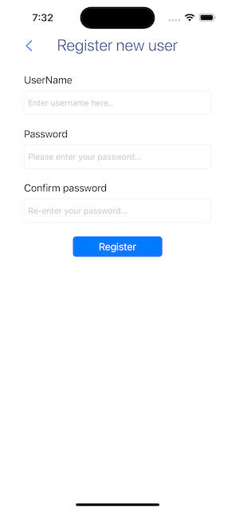
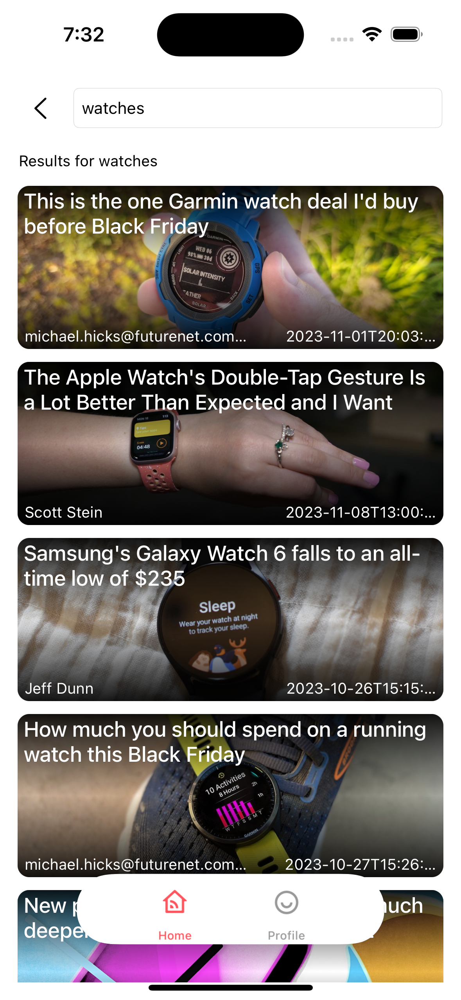

# Caploitte-iOS-assigment
Caploitte - News feed iOS app 

### User guide

1. In order to sign in and user the app user should be registered using the register new user screen

2. If the user is already registered then use sign in screen to login to the app

3. once user logged in he/she will be redirected to the home/dashboard screen and user is also able to filter the news by category in the home screen itself

4. if user clicks on see all button the user will be redirected to the top headlines section where the user can filter the news by category

5. in the home screen search bar user will be able to search for any news.

6. in the profile screen user can change the filter setting such as 'country' and 'language' and apply changes to reflect in the app

7. to logout the app user can click on logout button in the profile section
